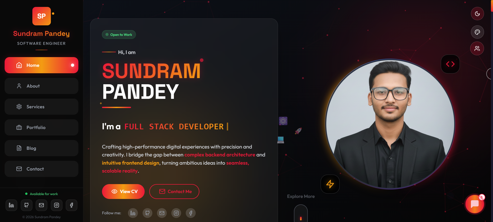
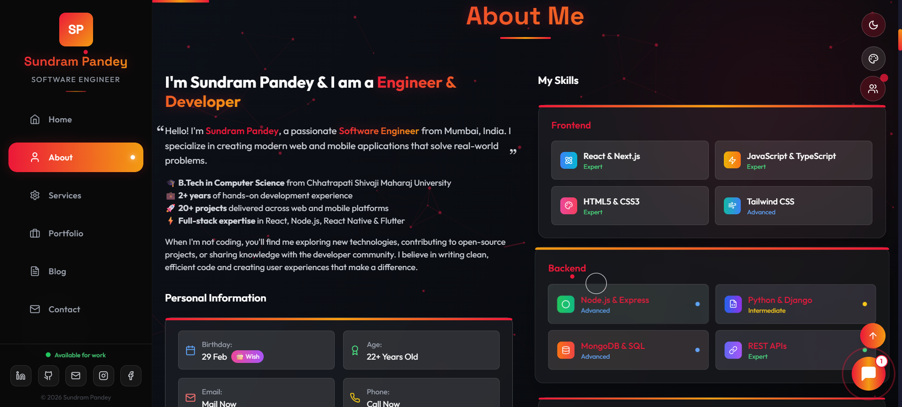
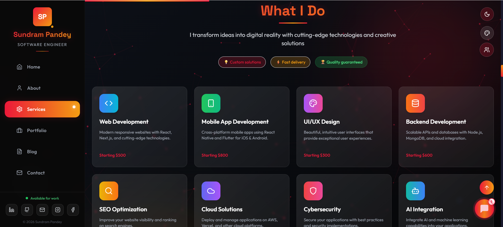
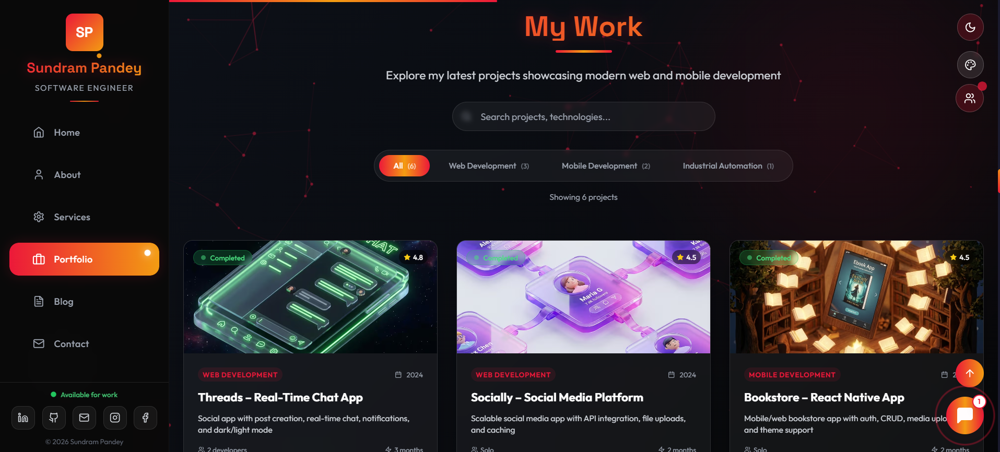
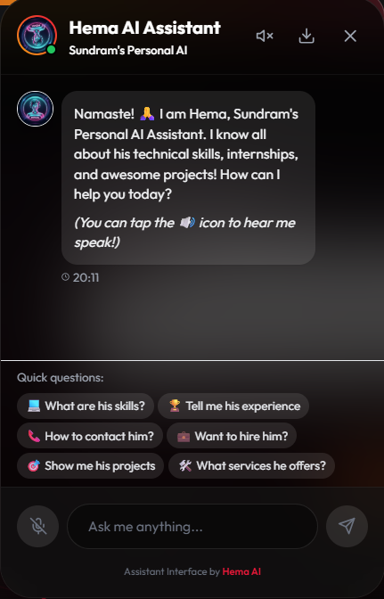
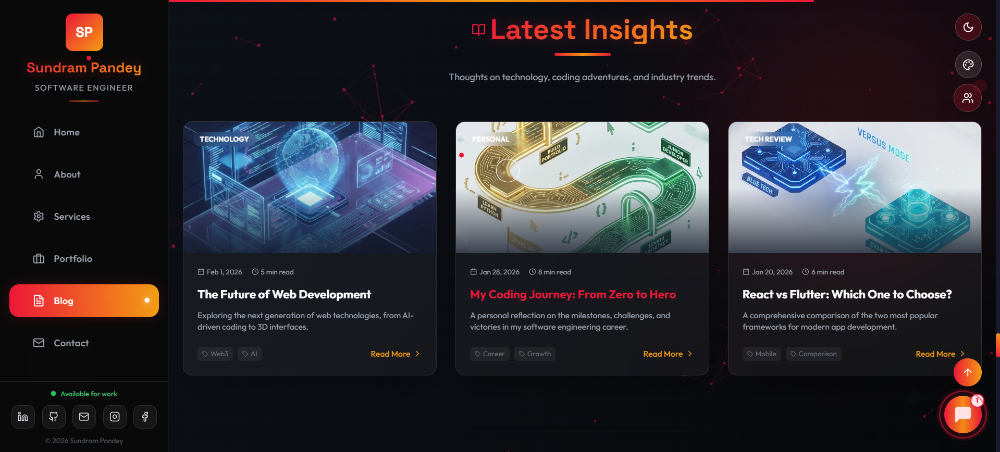
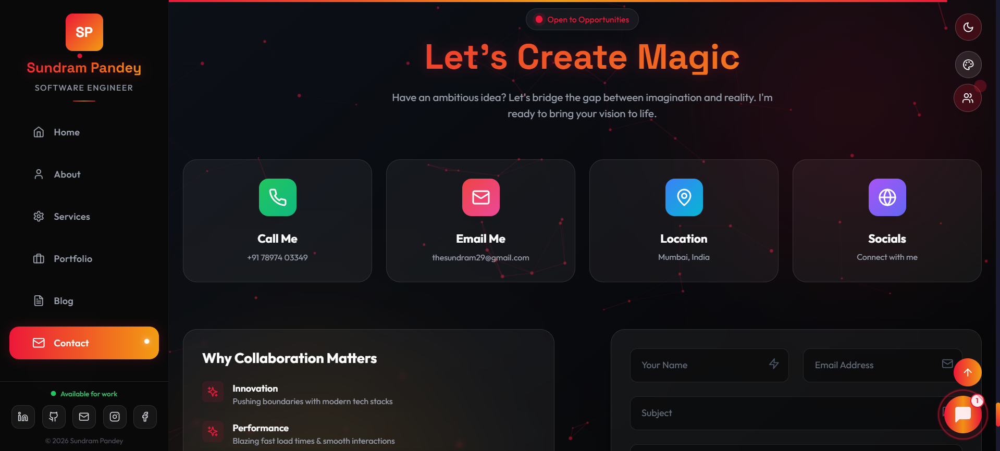
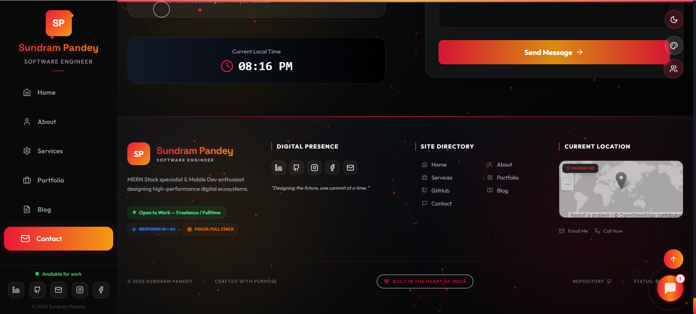

# 🚀 Sundram Pandey - Modern Portfolio

<div align="center">


</div>

A feature-rich, modern portfolio website built with Next.js 14, featuring advanced 3D elements, smooth animations, interactive components, and comprehensive functionality.

## 📸 Screenshots

<div align="center">

| 🚀 Hero Section | 👤 About Section |
| :---: | :---: |
|  |  |
| **🛠️ Services Section** | **📁 Portfolio Section** |
|  |  |
| **💬 AI Chatbot** | **✍️ Blog Section** |
|  |  |
| **📬 Contact Section** | **🔚 Footer Section** |
|  |  |

</div>

## ✨ Features

### 🎨 UI/UX
- **Modern 3D Depth**: Layered parallax effects and CSS perspective for a premium feel
- **Glassmorphism Design**: Sleek, transparent UI with vibrant gradient accents
- **Fully Responsive**: Optimized for seamless experiences on Mobile, Tablet, and Desktop
- **Dynamic Themes**: Dark mode with customizable primary color accents
- **Cinematic Motion**: Smooth scroll-triggered reveals and micro-animations
- **Interactive Backgrounds**: Particle systems and synchronized mouse-parallax grids

### 🌟 Interactive Components
- **3D Hero Stack**: Multi-layered profile reveal with hardware acceleration
- **AI Chatbot**: Intelligent assistant powered by Google Gemini AI
- **Project Showcase**: Filterable portfolio grid with interactive 3D tilt effects
- **GitHub Integration**: Real-time coding statistics and contribution tracking
- **Industrial Port**: Specialized section for Industrial Automation and PLC projects
- **Smart Contact**: Integrated form tracking with Nodemailer and visitor logging
- **Easter Eggs**: Delightful hidden secrets for an engaging user experience

### ⚡ Performance & Analytics
- Performance monitoring
- Loading screen with progress
- Error boundary implementation
- SEO optimized
- Analytics integration
- Back to top functionality
- Scroll progress indicator

## 🛠️ Tech Stack

- **Framework:** Next.js 14.0.4
- **Styling:** Tailwind CSS
- **Animations:** Framer Motion
- **3D Graphics:** Three.js, React Three Fiber, Drei
- **UI Components:** Lucide React
- **Email Service:** Nodemailer
- **Notifications:** React Hot Toast
- **Intersection Observer:** React Intersection Observer
- **Typing Effects:** React Typed
- **AI Integration:** Google Gemini AI (Generative AI SDK)

## 🚀 Getting Started

1. **Clone the repository:**
```bash
git clone https://github.com/thesundram/thesundramportfolio.git
cd thesundramportfolio
```

2. **Install dependencies:**
```bash
npm install
# or
pnpm install
# or
yarn install
```

3. **Set up environment variables:**
```bash
cp .env.example .env.local
# Add your email service credentials
```

5. **Run the development server:**
```bash
npm run dev
# or
pnpm dev
# or
yarn dev
```

5. **Open [http://localhost:3000](http://localhost:3000) in your browser.**

## 📁 Project Structure

```
thesundramportfolio/
├── public/
│   ├── images/
│   │   ├── portfolio/          # Portfolio project images
│   │   ├── hero.webp          # Hero section image
│   │   └── Sundram_CV.pdf     # Resume/CV file
│   ├── favicon.ico
│   └── manifest.json
├── src/
│   ├── app/
│   │   ├── api/
│   │   │   ├── chat/           # AI Chat API (Gemini)
│   │   │   ├── send-contact/   # Contact form API
│   │   │   └── send-birthday-wish/ # Birthday wish API
│   │   ├── cv/                # CV page
│   │   ├── globals.css        # Global styles
│   │   ├── layout.tsx         # Root layout
│   │   └── page.tsx           # Home page
│   ├── components/
│   │   ├── About.tsx          # About section
│   │   ├── Achievements.tsx   # Achievements showcase
│   │   ├── BackToTop.tsx      # Back to top button
│   │   ├── BirthdayWish.tsx   # Birthday wish feature
│   │   ├── Blog.tsx           # Blog section
│   │   ├── ChatBot.tsx        # AI chatbot (Gemini)
│   │   ├── CodeRain.tsx       # Matrix-style code rain
│   │   ├── ColorSwitcher.tsx  # Theme color switcher
│   │   ├── Contact.tsx        # Contact form
│   │   ├── CursorTrail.tsx    # Custom cursor effects
│   │   ├── EasterEgg.tsx      # Hidden easter eggs
│   │   ├── FloatingElements.tsx # Floating animations
│   │   ├── GitHubStats.tsx    # GitHub statistics
│   │   ├── Hero.tsx           # Hero section
│   │   ├── LiveClock.tsx      # Real-time clock
│   │   ├── LoadingScreen.tsx  # Loading animation
│   │   ├── Navbar.tsx         # Navigation bar
│   │   ├── ParticleBackground.tsx # Particle system
│   │   ├── Portfolio.tsx      # Portfolio showcase
│   │   ├── ScrollProgress.tsx # Scroll indicator
│   │   ├── Services.tsx       # Services section
│   │   ├── Testimonials.tsx   # Client testimonials
│   │   ├── ThemeToggle.tsx    # Dark/light theme
│   │   ├── Timeline.tsx       # Experience timeline
│   │   └── VisitorCounter.tsx # Visitor tracking
│   └── lib/
│       └── emailjs.ts         # Email service config
├── .env.local                 # Environment variables
├── .eslintrc.json            # ESLint configuration
├── .gitignore                # Git ignore rules
├── next.config.js            # Next.js configuration
├── package.json              # Dependencies
├── postcss.config.js         # PostCSS configuration
├── tailwind.config.js        # Tailwind CSS configuration
└── README.md                 # Project documentation
```

## 🎯 Key Sections

- **Hero:** Animated introduction with 3D elements
- **About:** Personal information and skills
- **Services:** Professional services offered
- **Portfolio:** Project showcase with live demos
- **Timeline:** Professional experience
- **Achievements:** Certifications and awards
- **Testimonials:** Client feedback
- **Blog:** Technical articles and insights
- **Contact:** Multi-channel communication

## 🔧 Customization

1. **Personal Information:** Update details in respective components
2. **Styling:** Modify `tailwind.config.js` for colors and themes
3. **Images:** Replace images in `public/images/`
4. **Content:** Update text content in component files
5. **API Keys:** Configure email service in `.env.local`

## 📦 Build & Deployment

```bash
# Build for production
npm run build

# Start production server
npm start

# Lint code
npm run lint
```

### Deploy on Vercel

1. Push to GitHub
2. Connect repository to Vercel
3. Configure environment variables
4. Deploy automatically

## 🌟 Performance Features

- **Image Optimization:** Next.js automatic image optimization
- **Code Splitting:** Automatic code splitting for faster loads
- **SEO:** Meta tags and structured data
- **PWA Ready:** Manifest and service worker support
- **Analytics:** Built-in performance monitoring

## 📧 Contact

- **Email:** [thesundram29@gmail.com](mailto:thesundram29@gmail.com)
- **LinkedIn:** [linkedin.com/in/thesundram](https://linkedin.com/in/thesundram)
- **GitHub:** [github.com/thesundram](https://github.com/thesundram)
- **Instagram:** [instagram.com/the.sun29](https://instagram.com/the.sun29)
- **Facebook:** [facebook.com/thesundram29](https://www.facebook.com/thesundram29)
- **Portfolio:** [Live Demo](https://thesundram.vercel.app)

## 📄 License

This project is open source and available under the [MIT License](LICENSE).

---

**Built with ❤️ by Sundram Pandey** | © 2026 All Rights Reserved